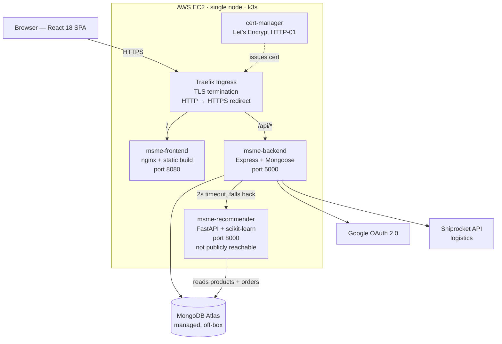

# PROJECT BRIEF — MSME Marketplace

This file is written to be the single source for someone writing a portfolio
page, a LinkedIn post, or resume bullets about this project, without reading the
code.

Every number in this document was measured in this repository on 2026-09-14.
Where a number could not be verified, that is stated rather than estimated.
Where something is weak, it says so.

---

## 1. ONE-LINE SUMMARY

A three-service e-commerce platform for small Indian manufacturers, inherited as
a four-person college project, audited for security, rebuilt around a real
recommendation service, covered with 133 automated tests, and deployed to AWS on
Kubernetes with HTTPS.

---

## 2. THE STORY

I did not write the original codebase. It was a four-person college team
project, and I inherited it.

What I did with it:

1. **Audited it.** I read the whole thing and wrote a findings document
   (`docs/audit-baseline.md`) covering the data model, every API route, the auth
   flow, the frontend pages, and what was finished versus half-built versus
   dead. That document is committed and still in the repo.

2. **Found real vulnerabilities.** Eleven auth and access-control weaknesses,
   including a privilege escalation that let any logged-in user make themselves
   an administrator with a single API call, and a line that disabled TLS
   certificate verification for the entire Node process. Details in section 7.

3. **Replaced a fake ML feature with a real one.** The seller dashboard
   advertised "XGBoost-driven forecasting & Linear Programming for stock
   optimization". There was no XGBoost and no linear programming. The actual
   implementation was `recentSales > (totalSold / 2) ? 1.4 : 1.0`, with the
   comment `// Simulated XGBoost trend boost`. I removed the false claims and
   built an actual recommendation service. Details in section 6.

4. **Added tests.** The project had none. It now has 133 automated tests across
   three suites.

5. **Shipped it.** Docker images, Kubernetes manifests, a Jenkins pipeline, a
   GitHub Actions workflow, and a live deployment on AWS with a real Let's
   Encrypt certificate.

**This framing is the honest one and it should be used.** "Inherited a codebase,
audited it, found and fixed real vulnerabilities, replaced a fabricated feature
with a working one, and deployed it" is a stronger and more credible claim than
"built a marketplace from scratch", and it is what actually happened.

---

## 3. WHAT THE PRODUCT DOES

Three roles: buyer, seller, admin.

### Buyer

- Register and sign in with email/password or Google OAuth 2.0.
- Browse a product catalogue with search, category filter and district filter.
- View a product page with images, price, size selection and quantity.
- See related products on the product page, and a recommended row on the
  storefront (both from the recommendation service).
- Add to wishlist; add to cart; update quantities; remove items.
- Check out with a saved or new shipping address, including geolocation autofill
  via Nominatim/OpenStreetMap.
- View order history with a four-step delivery status tracker.
- Manage saved addresses and a profile with an avatar.

### Seller

- Any buyer can become a seller through a dedicated onboarding flow, which
  collects business name, PAN name, district and state.
- List products with images, per-size stock, category and price. Stock totals
  are recomputed automatically, and a product de-lists itself when stock hits
  zero.
- Manage inventory across eight dashboard sections.
- View incoming orders and update their status.
- See a demand forecast derived from the seller's own order history, with 7, 15
  and 30-day projections and understock/overstock advice. **This is arithmetic,
  not a model** — see section 12.
- Revenue and sales-volume charts.
- Logistics panel with Shiprocket waybill generation and shipment tracking.
- Government scheme discovery and micro-loan modules.

### Admin

Four endpoints, all behind an authenticated role check:

| Route | Purpose |
|---|---|
| `GET /api/admin/stats` | User counts by role, product count, order count, total revenue, orders in the last 7 days |
| `GET /api/admin/users` | Paginated user list with search by name and email, filter by role |
| `PATCH /api/admin/users/:id/status` | Activate or deactivate an account |
| `GET /api/admin/orders` | Paginated order list, filterable by status |

There is deliberately **no HTTP route that grants the admin role**. The only way
to create an admin is a seeding script run directly against the database. An
admin cannot deactivate their own account, which would otherwise lock every
admin route with nobody able to lift it.

Deactivating a user takes effect on their next request, not when their token
expires, because the auth middleware re-reads the account state from the
database on every request.

---

## 4. ARCHITECTURE

Three services, each separately built, imaged and deployed.

### Why three and not one

- **The recommender is Python because the libraries are Python.** TF-IDF and
  cosine similarity come from scikit-learn. Reimplementing them in Node to keep
  a single runtime would be work with no benefit.
- **It is a separate process because its failure must not be the storefront's
  failure.** The Node backend calls it with a 2-second timeout and falls back to
  newest-first ordering if it is slow, down, or returns something unexpected. A
  broken recommender degrades the page; it does not break it.
- **It is separately deployable because its memory profile is different.** It
  holds similarity matrices in memory and is the largest consumer of the three
  (105 MiB measured, against 47 MiB for the backend).
- **The frontend is a separate image** because it is static files served by
  nginx, with a different build, a different base image and different scaling
  behaviour from an API process.

The recommender is never exposed publicly. Only the backend talks to it.



### Request paths worth knowing

- `GET /api/products/recommended` → backend → recommender `/recommend/trending`
- `GET /api/products/:id/similar` → backend → recommender `/recommend/product/:id`
- Everything else is backend → Atlas directly.

---

## 5. TECH STACK

| Technology | Where | Why this over the alternative |
|---|---|---|
| React 18 + Vite | Frontend | Vite over Create React App: CRA is unmaintained, and Vite's dev server starts in under a second on this codebase |
| TanStack Query 5 | Frontend server state | Replaced hand-rolled `useEffect` + `useState` fetching and `localStorage` caches. Gives request deduplication, cache invalidation and retry without writing them |
| react-hook-form + Zod | Frontend forms | Uncontrolled inputs, so typing does not re-render the form; Zod shares one schema between validation and types |
| react-window | Buyer grid | The catalogue renders every product; virtualising keeps the DOM small |
| Recharts | Seller analytics | Declarative React components rather than imperative D3 |
| Plain CSS | Styling | Inherited. No Tailwind in this project |
| Express 4 + Mongoose 8 | Backend API | Inherited choice, kept. Mongoose's schema layer is doing real work — it is what strips unknown fields, including the `role` field in the privilege-escalation fix |
| MongoDB Atlas | Database | Managed, free tier, no database to operate on a 2 GiB box |
| FastAPI | Recommender | Automatic request validation via Pydantic and a typed response contract, with less code than Flask |
| scikit-learn | Recommender | TF-IDF vectoriser and cosine similarity are one import each; hand-rolling them would be slower and more error-prone |
| JWT, split access/refresh | Auth | 15-minute access token limits the damage from a stolen token; a 7-day refresh token with rotation keeps users signed in |
| Docker, multi-stage, non-root | All three services | Build tooling stays out of the runtime image; non-root because there is no reason for these processes to be root |
| Kubernetes (k3s) | Deployment | k3s over EKS: an EKS control plane is $73/month. k3s is a single binary on one EC2 instance |
| Traefik | Ingress | k3s already ships and runs it. ingress-nginx would cost roughly 100 MiB more on a box with ~480 MiB spare |
| cert-manager + Let's Encrypt | TLS | Automatic issuance and renewal; no manual certificate handling |
| nip.io | Hostname | Resolves `<name>.<dashed-ip>.nip.io` to that IP, which gives a real hostname — and therefore a real certificate — with no domain to buy |
| Kustomize | Manifests | Overlays over Helm: no templating language, and the base manifests stay readable YAML |
| Jenkins | CI | Self-hosted, runs the full pipeline including deploying to a local cluster and running E2E against it |
| GitHub Actions | Image publishing | See section 8 — it exists alongside Jenkins for a specific reason |
| Playwright | E2E | Auto-waiting removes the sleep-and-hope pattern; one browser binary, no Selenium grid |
| Jest + supertest + mongodb-memory-server | Backend tests | Real HTTP against a real in-memory MongoDB, so schema behaviour is exercised rather than mocked |
| husky + commitlint + lint-staged | Git hygiene | Conventional commits enforced at commit time rather than reviewed after the fact |

---

## 6. THE RECOMMENDER — the headline feature

### What it replaced

The seller dashboard displayed the text **"XGBoost-driven forecasting & Linear
Programming for stock optimization"**. The repository contained no XGBoost, no
linear programming, and no ML dependency in either `package.json`.

The actual implementation, in `orderController.js`:

```js
const trendMultiplier = recentSales > (totalSold / 2) ? 1.4 : 1.0; // Simulated XGBoost trend boost
```

A hardcoded constant behind a comment naming a library that was not installed.

There was also **no product recommendation system at all** — no collaborative
filtering, no content similarity, no popularity ranking. Buyers saw products
sorted by `createdAt: -1`.

**What I did about it, precisely:**

- Removed the false labels. The UI now says "Demand forecast from your order
  history." The constant still exists, but it is named `RECENT_SALES_UPLIFT` and
  carries the comment *"Hand-chosen, not derived from any model."* The
  arithmetic forecast was not deleted — it produces numbers that respond to real
  order data. It was made honest, not removed.
- Built a genuine recommendation service as a separate feature. This is the
  thing that is new, and it is product recommendations, not demand forecasting.

Both halves of that should be stated accurately. Replacing a dishonest label
with an honest one is not the same as replacing arithmetic with a model.

### The method

**Content-based similarity.** Each product becomes a text document from its
name, description and category, with the **category deliberately repeated
twice** so it is not drowned out by a long description. Those documents go
through a scikit-learn `TfidfVectorizer` with English stop words, lowercasing,
`min_df=1` and an **n-gram range of (1, 2)** — unigrams and bigrams, so "silk
saree" is a feature in its own right and not just "silk" and "saree". Cosine
similarity over that matrix gives item-item scores.

**Collaborative filtering.** The signal is co-purchase: which products appear
in the same buyer's history, whether in one order or several. Buyers are grouped
into sets of distinct products, and **only buyers with two or more distinct
products contribute** — a single-item buyer links nothing to anything. That
produces a buyer × product binary matrix, and item-item cosine similarity is
computed over it. Products never bought have an all-zero column and score zero,
which is correct: no evidence, no recommendation.

**The hybrid blend.** Both score sets are **min-max normalised first**, so
neither can dominate merely because its raw scale is larger. The blend is then:

```
score = 0.6 × content_normalised  +  0.4 × collaborative_normalised
```

Content is weighted higher because it works for every product, including ones
nobody has bought. The weights are configurable (`content_weight`,
`collab_weight`) and are normalised by their sum, so they do not have to add to 1.

Each result is tagged with its source — `content`, `collab`, or `hybrid`. The
source is decided by **which model produced the item, not by its normalised
score**, because min-max maps the weakest item to exactly 0.0 and testing
`score > 0` would mislabel the lowest-ranked content item.

**Cold start.** When there is no collaborative signal at all — a new deployment,
or too few multi-item buyers — content scores carry the result **at full
weight** rather than being scaled down by 0.6. Scaling them would rank
everything lower for no reason, since there is nothing to rank against. The
reverse case is handled symmetrically. Below two qualifying buyers, the
collaborative model reports itself not-ready and the system runs content-only.

**Filtering.** Inactive and zero-stock products are never recommended, and the
query product itself is excluded from its own results.

**Caching.** Similarity matrices are computed once at service startup and held
in memory; `POST /reindex` rebuilds them. There is no TTL cache and no Redis —
requests hit an in-memory matrix, not a recomputation. On the measured dataset a
full rebuild takes **267 ms**. On the calling side, the Node backend applies a
**2-second timeout** and falls back to newest-first if the recommender does not
answer.

### The numbers

Measured on the live deployment, 2026-09-14, via `POST /reindex` and
`GET /metrics`:

| Metric | Value |
|---|---|
| Products indexed | 202 |
| Orders indexed | 310 |
| Full reindex time | 267 ms |
| Evaluation | 80/20 time-based split |
| Train orders | 248 |
| Test orders | 62 |
| Users evaluated | 60 |
| **precision@10** | **0.075** |
| **recall@10** | **0.3028** |

Evaluation method: orders are split chronologically at 80%, the model is scored
on whether its top-10 recommendations appear in each buyer's held-out future
orders.

### Read these numbers honestly

**These are measured on synthetic, seeded data.** The products and orders were
generated by seeding scripts, not produced by real buyers. Co-purchase patterns
in seeded data are close to random, which is the dominant reason the numbers are
what they are. They say the pipeline computes correctly end to end. They say
nothing about how this would perform against real traffic.

**precision@10 of 0.075 is low.** It means that of ten recommendations, fewer
than one appeared in the buyer's held-out orders. Recall@10 of 0.30 is the more
flattering number and it is flattered by small basket sizes — when a buyer's
test set holds two items, finding one is 50% recall.

Do not describe this as a high-performing model. The defensible claim is that a
hybrid recommender was implemented, evaluated with a proper time-based split
rather than a random one, and reports its own metrics through an API — not that
it achieves good accuracy.

---

## 7. SECURITY

All of these were found by reading the inherited code. Each is recorded in
`docs/audit-baseline.md` and each fix is verified present in the current code.

### 7.1 Privilege escalation via update-profile

**What it was.** `PUT /api/auth/update-profile` passed the request body
through to the user document, including the `role` field.

**What an attacker could do.** Any registered user — no special access needed —
could send `{"role": "admin"}` to their own profile endpoint and become an
administrator. One request, from a normal logged-in account.

**How it was fixed.** The controller now destructures only the fields a user is
allowed to change and builds the update object explicitly. `role` is absent by
construction, with a comment stating why. Becoming a seller goes through a
dedicated `POST /api/auth/become-seller` endpoint that hardcodes the value
`'seller'`.

### 7.2 No role enforcement anywhere

**What it was.** `role` existed on the user model and **was never checked in any
route or controller**. There was no role middleware.

**What an attacker could do.** Any logged-in buyer could create products
(`POST /api/products`), read seller order endpoints, and reach the `/seller` and
`/admin` screens. The admin dashboard displayed hardcoded values, so it leaked
nothing, but the seller endpoints were live.

**How it was fixed.** A `requireRole(...roles)` middleware was added and applied
across the product, order and admin route files. The E2E suite asserts both
halves: that a buyer is redirected out of `/seller` and `/admin` in the browser,
**and** that the API refuses the same routes regardless of what the browser did.

### 7.3 Unprotected waybill and tracking endpoints

**What it was.** `POST /api/orders/:id/generate-waybill` and
`GET /api/orders/track/:trackingId` performed no ownership check.

**What an attacker could do.** Any authenticated user could generate shipping
waybills against orders belonging to other sellers, and could read any order by
tracking ID — exposing another customer's name, phone number and full shipping
address.

**How it was fixed.** Waybill generation is behind a seller role check. Tracking
loads the order **unpopulated first**, so no buyer identity is fetched before the
caller is authorised, then verifies the caller is either the order's buyer or one
of its sellers and returns 403 otherwise. Only then is the populated order
loaded.

### 7.4 Process-wide TLS verification disabled

**What it was.** `process.env.NODE_TLS_REJECT_UNAUTHORIZED = '0'` at the top of
`server.js`, plus `tlsAllowInvalidCertificates` and `tlsAllowInvalidHostnames` in
the database config.

**What an attacker could do.** This disables certificate verification for
**every outbound TLS connection in the process** — MongoDB Atlas, Google OAuth,
Shiprocket. Anyone able to intercept traffic could present a self-signed
certificate and the application would accept it, exposing the database
credentials and every OAuth exchange to a man-in-the-middle.

**How it was fixed.** All three settings were removed. No occurrence remains in
the codebase.

### 7.5 JWT in localStorage

**What it was.** The token was written to `localStorage` on login, register,
`getMe` and `updateProfile`, *and* set as an httpOnly cookie. The full user
object was stored there too.

**What an attacker could do.** An httpOnly cookie exists specifically so that
JavaScript cannot read the token. Writing the same token to `localStorage`
defeats that entirely: any cross-site-scripting flaw, including one in a
third-party dependency, could read the token and impersonate the user.

**How it was fixed.** Tokens are no longer stored in `localStorage`. Auth runs
on httpOnly cookies through a shared HTTP client. Supporting changes: cookies are
now `secure: process.env.NODE_ENV === 'production'` instead of a hardcoded
`secure: false`; access tokens dropped from 7 days to **15 minutes**; refresh
tokens rotate, with replay detection; and CSRF protection was added, which the
cookie-only model makes necessary.

### 7.6 Seller caches surviving sign-out

**What it was.** Buyer and seller screens cached data in `localStorage` and did
not clear it on sign-out.

**What an attacker could do.** On a shared machine, the next person to use the
browser could read the previous user's cached catalogue and dashboard state
without signing in.

**How it was fixed.** The `localStorage` caches were removed entirely and server
state moved to TanStack Query, which holds cache in memory and is discarded on
reload. The HTTP client clears the stored user object when a refresh fails.

### 7.7 Secrets traced into the Jenkins console log

**This one was mine, not inherited.** It is included because finding and fixing
your own mistake is part of the record.

**What it was.** A Jenkins pipeline step sourced the backend `.env` to seed E2E
data. Jenkins runs shell steps as `sh -xe`, and `-x` traces every expanded
command. The trace printed `MONGO_URL` — including the Atlas password —
`JWT_SECRET` and `GOOGLE_CLIENT_SECRET` into the build console.

**What an attacker could do.** Anyone with read access to the Jenkins job could
read live database credentials from the build log.

**How it was fixed.** The step disables tracing before touching the credential
file and extracts only the single variable it needs, rather than sourcing the
whole file. The affected build was deleted and the Jenkins home directory was
searched to confirm no remaining file contained the value. The same pattern is
applied in `scripts/aws-bootstrap.sh`, which sets `set +x` as its first line and
never re-enables it, so even running it under `bash -x` cannot trace a line that
reads the credential file.

### 7.8 Other findings from the audit

Recorded and fixed or documented: rate limiting applied only to login and
register, not to password reset; `/forgot-password` returned 404 for unknown
emails, allowing user enumeration; password policy enforced only in the React
forms, so API-direct registration accepted any password; no CSRF protection with
`sameSite: 'lax'` cookies and credentialed CORS; and auth middleware that never
re-read the database, so a deleted or demoted user kept full access until their
7-day token expired.

---

## 8. ENGINEERING PRACTICE

### Testing — 133 tests

| Suite | Tests | Files | Coverage |
|---|---|---|---|
| Jest (backend) | **91** | 9 suites | 60.06% lines, 59.16% statements, 51.88% branches, 47.41% functions |
| pytest (recommender) | **31** | 5 | **82%** of `app/` |
| Playwright (E2E) | **11** | 6 | not a coverage metric |
| **Total** | **133** | | |

Backend tests run against a real in-memory MongoDB via `mongodb-memory-server`
and drive real HTTP through supertest, so Mongoose schema behaviour is exercised
rather than mocked. Suites cover auth, refresh-token rotation, CSRF, roles,
admin, orders, validation, recommendations and health.

The E2E suite runs against a **deployed** application, not a dev server. It
covers: register → sign out → sign back in; wrong password refused; search →
product → cart → checkout; a buyer blocked from `/seller` and `/admin` in both
the UI and the API; become-seller → create product → find it in the catalogue;
and recommendations appearing on a product page and the storefront. It uses
Playwright fixtures and a seeded account, relies on auto-waiting rather than
sleeps, seeds its own data through a script, and tags and removes what it
creates.

Backend coverage of 60% is **moderate, not high**. It is concentrated on auth
and access control, which is where the risk is, and is thin on the seller
dashboard controllers.

### CI/CD

**Jenkins** (`jenkinsfile`, declarative) runs seven stages plus a gated release:

1. Checkout
2. Lint — frontend and backend in parallel
3. Unit tests — jest and pytest in parallel, JUnit XML published
4. Build images — three images, tagged with the git short SHA
5. Deploy — `kubectl apply` to the dev overlay
6. E2E — Playwright against the deployed application
7. Publish — coverage and the Playwright HTML report
8. A manual `input` approval gate, then the production stages

Pipeline options: 30-minute timeout, 10 builds retained, credentials read from
Jenkins credential bindings with no inline secrets, and a `post` block with
`junit`, `archiveArtifacts` and `cleanWs`.

**Why GitHub Actions exists alongside it.** They do different jobs. Jenkins runs
on a local machine and can deploy to a local Kubernetes cluster and run E2E
against it — it has the kubeconfig and the cluster is on the same host. It
cannot publish images that a remote AWS box can pull, because it is not
internet-reachable. GitHub Actions builds the three images and pushes them to
`ghcr.io` on every push to `main`, which is what the EC2 instance pulls from.
Jenkins validates; Actions distributes. The EC2 box cannot build its own images —
`npm ci` for the frontend alone peaks above 1 GiB on a 2 GiB machine.

### Kubernetes

Deployed: three Deployments, three Services, one Ingress, one HPA, a ConfigMap
and a Namespace — 10 objects for base, dev and prod. The AWS overlay adds two
Let's Encrypt ClusterIssuers and a Traefik redirect Middleware, rendering to 13.

The Secret is deliberately **not** one of them. It is created at deploy time by
`k8s/make-secret.sh`, which copies exactly five keys out of the environment file
and nothing else, so no other value in that file can override what the ConfigMap
sets. What is committed is a template with placeholder values.

**Probes**, all on `/health`:

| Probe | Config |
|---|---|
| Liveness | initialDelay 20s, period 20s, timeout 5s |
| Readiness | initialDelay 5s, period 10s, timeout 3s |
| Startup | period 5s, failureThreshold 24 (base) / 60 in the AWS overlay |

The startup probe is raised to 60 × 5s = 300s on AWS because the backend does
`connectDB().then(() => app.listen())` — nothing serves `/health` until Mongoose
connects, and Atlas is across the public internet, so a slow database is
indistinguishable from a broken application without that allowance.

**HPA.** Base configuration: min 1, max 5, target 70% CPU utilisation of the
request (100m request, so it trips at 70m per pod), with a 30-second scale-up
stabilisation window and a 300-second scale-down window — quick to react to a
spike, slow to give capacity back mid-burst. The AWS overlay caps `maxReplicas`
at 2 to fit the node.

**Measured scale event: CPU utilisation rose from 29% to 498% and the HPA scaled
the backend from 1 replica to 3.** Provenance, stated plainly: this was observed
during a load test against the local minikube cluster using the base HPA
configuration, and it is **not reproducible on the AWS deployment**, where
`maxReplicas` is 2. It is also **not captured as a committed artifact in this
repository** — unlike every other number in this document, it cannot be
re-verified from the repo. Treat it as a supporting anecdote, not a headline
metric, and do not put it in a resume bullet as a hard number.

### Git practice

- **50 commits**, conventional-commit format, enforced by `commitlint` with
  `@commitlint/config-conventional` through a husky `commit-msg` hook.
- **8 branches**, feature-branched by concern: `feat/admin`, `feat/aws-deploy`,
  `feat/ci`, `feat/k8s`, `feat/oauth`, `feat/react-query`, `feat/recommender`,
  merged into `main`.
- **Pre-commit hook** runs `lint-staged`, which runs ESLint `--fix` and Prettier
  inside each workspace — necessary because the two workspaces have separate
  flat ESLint configs and different ESLint major versions.
- Commit messages carry reasoning in the body, not just a subject line.

Also in the repo: `knip` and `depcheck` configured for repeatable dead-code
sweeps, and a documented audit (`docs/audit-baseline.md`).

---

## 9. DEPLOYMENT

**Live URL: https://msme.52-63-85-62.nip.io**

Verified working on 2026-09-14: `/` returns 200, `/buyer` returns 200, and
`/api/products/categories` returns 200 with real data. HTTP redirects to HTTPS
with a 302. The certificate is issued by Let's Encrypt production (not staging)
and is valid to **13 December 2026**; `curl` succeeds without `-k` against the
system trust store.

**Infrastructure**

| Component | Detail |
|---|---|
| Compute | 1 × EC2 t3.small — 2 vCPU, 1907 MiB usable RAM, no swap |
| Storage | 30 GiB gp3 (4.3 GiB used) |
| Region | ap-southeast-2 (Sydney) |
| OS | Ubuntu 24.04.4 LTS |
| Orchestration | k3s v1.36.4, single node, control plane and workload on the same box |
| Ingress | Traefik v3 (bundled with k3s) |
| TLS | cert-manager v1.21.2, Let's Encrypt HTTP-01 |
| Hostname | nip.io — no domain purchased |
| Images | ghcr.io, public, linux/amd64 |
| Database | MongoDB Atlas M0 (free tier), off-box |

**Cost** — figures verified for ap-south-1 (Mumbai); the instance actually runs
in ap-southeast-2 (Sydney), where on-demand rates are higher. The Sydney rate
could not be verified, so this table is a floor, not the bill.

| Item | Rate | Running 24/7 | Stopped |
|---|---|---:|---:|
| EC2 t3.small | $0.0224/hr | $16.35 | $0 |
| EBS gp3, 30 GiB | ≈$0.092/GiB-mo | ≈$2.74 | ≈$2.74 |
| Elastic IP | $0.005/hr | $3.65 | $3.65 |
| Data transfer, Atlas M0, GHCR, Let's Encrypt | — | $0 | $0 |
| **Total** | | **≈$22.74/mo** | **≈$6.39/mo** |

**How it is kept cheap**

- k3s instead of EKS — an EKS control plane alone is $73/month.
- Atlas M0 free tier instead of running a database on the box.
- Public GHCR images instead of a paid registry.
- nip.io instead of a purchased domain.
- Let's Encrypt instead of a paid certificate.
- The instance can be stopped when idle, dropping the cost to about $6/month.
  The elastic IP is deliberately kept while stopped: without it the public IP
  changes on restart, which changes the nip.io hostname, which invalidates the
  certificate and the Atlas allowlist entry.
- T3 credit specification set to `standard`, not the default `unlimited`, which
  silently bills for surplus CPU once credits run out.

---

## 10. NUMBERS

Every figure below was measured in this repository. Nothing is estimated.

| Metric | Value | How measured |
|---|---|---|
| Total automated tests | **133** | Sum of the three suites below |
| Jest tests | 91 in 9 suites | `jest --coverage`, all passing |
| Jest line coverage | 60.06% | Same run |
| Jest statement / branch / function coverage | 59.16% / 51.88% / 47.41% | Same run |
| pytest tests | 31 | `pytest --cov=app`, all passing |
| pytest coverage | 82% of `app/` | Same run |
| Playwright tests | 11 in 6 files | `playwright test --list` |
| precision@10 | 0.075 | Live `/metrics`, synthetic data |
| recall@10 | 0.3028 | Live `/metrics`, synthetic data |
| Users evaluated | 60 | Live `/metrics` |
| Train / test orders | 248 / 62 | 80/20 time-based split |
| Products indexed | 202 | Live `/reindex` |
| Orders indexed | 310 | Live `/reindex` |
| Full model rebuild | 267 ms | Live `/reindex` |
| Hybrid weights | 0.6 content / 0.4 collaborative | `app/hybrid.py` |
| Recommender call timeout | 2000 ms | `utils/recommender.js` |
| Access token lifetime | 15 minutes | `utils/tokens.js` |
| Refresh token lifetime | 7 days | `utils/tokens.js` |
| Commits | 50 | `git rev-list --count HEAD` |
| Branches | 8 | `git for-each-ref` |
| Tracked files | 183 | `git ls-files` |
| Backend source | 5,117 lines / 47 files | `git ls-files` + `wc -l` |
| Frontend source | 14,654 lines / 47 files | Same |
| Recommender source | 800 lines / 9 files | Same |
| Kubernetes manifests | 1,016 lines / 17 files | Same |
| Node memory in use | 1,426 MiB of 1,907 MiB (72%) | `kubectl top node`, live |
| Memory headroom | 480 MiB | `free -m`, live |
| Pod memory: recommender / backend / frontend | 105 MiB / 47 MiB / 4 MiB | `kubectl top pods`, live |
| Cluster CPU requests | 420m (21% of node) | `kubectl describe node` |
| Cluster memory requests | 524 MiB (27% of node) | Same |
| Pod restarts since deploy | 0 | `kubectl get pods`, live |
| OOM kills | 0 | `kubectl get events` + `dmesg` |
| Disk used | 4.3 GiB of 29 GiB | `df -h`, live |
| Running cost | ≈$22.74/month | ap-south-1 rates; Sydney is higher and unverified |
| Certificate expiry | 13 December 2026 | `openssl s_client` from outside |

**Deliberately excluded** because they could not be verified: the Sydney EC2
hourly rate, and any request-throughput or latency benchmark (no load test
artifact exists in the repo). The 29% → 498% / 1 → 3 replica scale event is
reported in section 8 with its provenance, and is **not** listed here because it
cannot be re-verified from this repository.

---

## 11. HARD-WON BUGS

Six real bugs, each found by investigation rather than guesswork.

**1. JWT ID collision broke refresh-token rotation.** Two tokens signed for the
same user within the same second were byte-identical, because the JWT `iat`
claim has only one-second resolution and nothing else in the payload varied — so
rotation handed back the exact token it was meant to replace, and replay
detection could never fire. Fixed by adding a `jti` claim of 16 random bytes to
every token, making each one unique regardless of timing.

**2. A `setInterval` kept the Jest process alive forever.** The in-memory rate
limiter schedules a cleanup timer every 15 minutes, and in Node a pending timer
keeps the event loop alive — so anything that imported the app, including the
entire test suite, hung instead of exiting. Fixed with `cleanupTimer.unref()`,
which lets the timer run while the process is alive without being a reason to
keep it alive.

**3. The `/seller` route guard would have blocked seller signup.** Adding
role-based route guards meant `/seller` required the `seller` role — but the
seller onboarding form was rendered inside that same route, so a buyer trying to
become a seller was redirected away from the page that would have made them one.
Fixed by moving onboarding off `/seller` onto its own route reachable by any
authenticated user.

**4. `kubectl wait` exits immediately when nothing matches.** The AWS bootstrap
script waited for the node with `kubectl wait --for=condition=Ready node --all`,
which does not wait for a resource to *exist* — with no node registered it
returns "no matching resources found" and exits non-zero at once. On a fresh k3s
install the API server accepts connections roughly 20 seconds before the kubelet
registers the node, so the script killed itself on a perfectly healthy machine;
fixed by polling for the object to appear first, and the same fix was applied to
two other waits with the same shape.

**5. `mktemp -t` is not portable and broke the deploy on Linux.** `make-secret.sh`
called `mktemp -t msme-secret`, which works on macOS — BSD `mktemp` treats the
argument as a filename prefix — but GNU `mktemp` requires a template with at
least three `X` characters and fails with "too few X's in template". The script
had only ever run on a Mac, so it failed the first time it ran on the Ubuntu
box, aborting the bootstrap under `set -e` with nothing deployed; fixed by
spelling out an explicit template path that is valid on both.

**6. A Jenkins release gate hung every single build.** A production stage had
both a `when` condition and an `input` approval step, and declarative Jenkins
evaluates `input` **before** `when` unless told otherwise — so every build
stopped and waited for a human approval on a stage whose condition would have
skipped it anyway. Fixed with `beforeInput true`, which forces the condition to
be evaluated first.

---

## 12. LIMITATIONS

Stated plainly. None of this should be omitted from an honest write-up.

- **Single node, no high availability.** One EC2 instance running both the k3s
  control plane and every workload. If it dies, everything is down. Every deploy
  is a brief outage because there is no room to run a second copy of a pod
  during a rollout — rollouts are configured `maxSurge: 0` for exactly that
  reason.
- **The data is synthetic.** Products, orders and buyers were generated by
  seeding scripts. No real user has ever used this. All recommender metrics are
  computed on that synthetic data and should be read accordingly.
- **Payments are not real.** There is no payment gateway integration. Orders
  carry a `paymentStatus` field and checkout completes without money moving.
- **There is no trained ML model.** The recommender is TF-IDF plus cosine
  similarity plus a weighted blend — established information-retrieval
  techniques, computed statistics, not a learned model. There is no training
  step, no learned parameters, no model artifact. Calling it "machine learning"
  is a stretch; calling it "a statistical recommender" is accurate.
- **The seller demand forecast is still arithmetic.** It projects from average
  daily demand with a hand-chosen 1.4 multiplier. The dishonest labelling was
  removed; the method was not upgraded.
- **Recommender accuracy is low.** precision@10 = 0.075. See section 6.
- **Shiprocket integration is partial.** Waybill generation and tracking exist,
  but have not been exercised against the live Shiprocket API in this
  deployment.
- **Backend test coverage is 60%**, concentrated on auth and access control and
  thin on seller dashboard controllers. The frontend has no unit tests at all —
  only the 11 end-to-end tests.
- **The rate limiter is in-memory and per-process.** Behind a proxy, every
  request can share one key, and it resets when the pod restarts. It is a speed
  bump, not a defence.
- **One region, no CDN, no caching layer.** The Compose file starts a Redis
  container that nothing in the application actually uses.
- **The nip.io hostname depends on the elastic IP.** Release the IP and the URL,
  the certificate and the Atlas allowlist entry all break.
- **The live URL is only up while the instance is running.** It is stopped when
  idle to save money, so the link may be down when someone clicks it.
- **Accessibility and internationalisation were not addressed.** No audit was
  done, and the UI is English-only despite targeting Indian regional sellers.

---

## 13. WHAT I CAN AND CANNOT CLAIM

**The next AI writing from this file must not invent claims beyond this list.**

### True to say

- I inherited a four-person college project and audited the entire codebase,
  producing a written findings document that is committed to the repository.
- I found a privilege-escalation vulnerability that let any logged-in user make
  themselves an administrator, and I fixed it.
- I found that role-based access control did not exist anywhere despite a `role`
  field on the user model, and I implemented and tested it.
- I found and fixed two endpoints that leaked other customers' names, phone
  numbers and shipping addresses through missing ownership checks.
- I found and removed a line that disabled TLS certificate verification for the
  entire Node process.
- I moved authentication from a JWT in `localStorage` to httpOnly cookies with
  15-minute access tokens, refresh-token rotation with replay detection, and
  CSRF protection.
- I found a feature advertised in the UI as "XGBoost-driven forecasting" that
  was a hardcoded constant, and I removed the false claim.
- I designed and built a hybrid recommendation service — TF-IDF content
  similarity and co-purchase collaborative filtering, blended 0.6/0.4 with
  min-max normalisation and explicit cold-start handling — as a separate FastAPI
  service with its own evaluation endpoint.
- I took the project from zero tests to 133 across three suites, with 82%
  coverage on the recommender and 60% line coverage on the backend.
- I containerised all three services as multi-stage non-root images.
- I wrote the Kubernetes manifests — Deployments, Services, Ingress, HPA,
  ConfigMap, Secret — with liveness, readiness and startup probes, using
  Kustomize overlays for three environments.
- I built a Jenkins declarative pipeline with parallel lint and test stages,
  image builds, deployment, end-to-end tests and a gated production release.
- I deployed the application to AWS on k3s with automatic TLS from Let's
  Encrypt, for about $23/month, and verified it end to end from outside.
- I found and fixed my own security mistake — secrets traced into a CI log by
  `sh -xe` — and verified the leaked values were purged.

### Would be an overstatement

- ❌ "Built a marketplace from scratch." I did not. I inherited it.
- ❌ "Machine learning engineer" or "trained an ML model." No model is trained.
  There are no learned parameters.
- ❌ "Built an XGBoost demand forecasting system." The opposite — I found a fake
  XGBoost claim and removed it.
- ❌ Any accuracy claim framed as good. precision@10 is 0.075 on synthetic data.
- ❌ "Production system" or "serving real users." It has no real users, no real
  payments, and is stopped when idle.
- ❌ "Highly available", "scalable", "fault tolerant." One node, no redundancy.
- ❌ "99.9% uptime" or any uptime figure. None was measured.
- ❌ Any throughput, latency or requests-per-second number. None was measured.
- ❌ "Full test coverage." Backend line coverage is 60%; the frontend has no
  unit tests.
- ❌ "Microservices architecture." Three services is not a microservices
  architecture, and claiming it invites questions this project cannot answer.
- ❌ Treating the 29% → 498% CPU / 1 → 3 replica scale event as a verified
  headline metric. It was observed on a local cluster and is not reproducible
  from this repository.

---

## 14. LINKS

| What | Where |
|---|---|
| Repository | https://github.com/pavansai2608/msme-marketplace |
| Live application | https://msme.52-63-85-62.nip.io |
| Container images | `ghcr.io/pavansai2608/msme-backend`, `-frontend`, `-recommender` (public) |
| Audit document | `docs/audit-baseline.md` in the repository |
| AWS runbook and cost table | `aws/README.md` |
| Kubernetes notes | `k8s/README.md` |
| Jenkins setup | `jenkins/README.md` |

**Note on the live URL:** the EC2 instance is stopped when idle to keep costs
down, so the link may not respond. The elastic IP is retained, so the same URL
works again once the instance is started — it does not need to be reissued.
